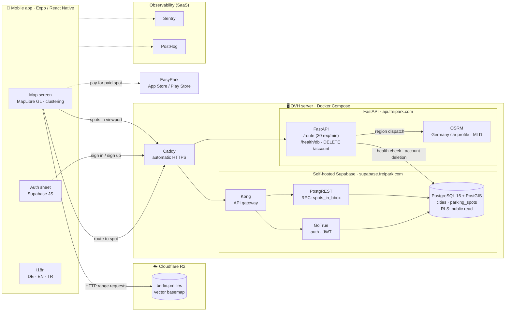
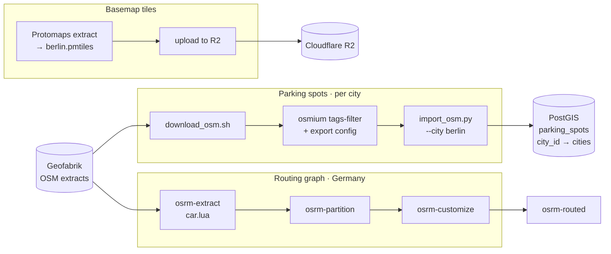
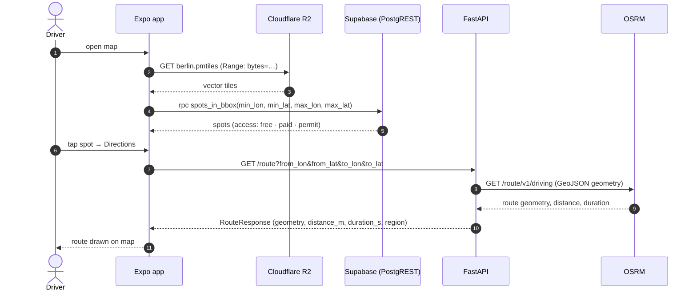

# 🅿️ FreiPark

**Find street parking in Berlin before you circle the block.** FreiPark shows drivers where **free**, **paid** and **permit-zone** street parking is, draws a driving route to the spot you pick, and sends you to EasyPark to pay for paid spots.

> Built in Berlin. Berlin is the first city; cities are a first-class schema concept, so adding the next one is a single `INSERT` plus one import run, with no migration.

**Design constraint: no per-request costs that grow with users.** Map tiles, routing, auth and the database are all self-hosted or served as static files, so a traffic spike doesn't turn into an API bill.

---

## Features

- 🗺️ **Vector map of every mapped street-parking spot.** Clustered markers handle thousands of spots smoothly.
- 🟢 🟡 🔵 **Free / paid / permit** classification from OpenStreetMap tags
- 🧭 **Driving route to a spot**, with distance and travel time, from a self-hosted OSRM routing engine
- 💳 **Paid spots** link out to EasyPark (no in-app payments)
- 👤 **Optional account** (email + password) with cross-device sessions and self-service account deletion
- 🌍 **German by default**, with English and Turkish
- 📈 **Observability:** Sentry (errors + session replay) and PostHog (product analytics, structured logs)

---

## System architecture



**How a session flows:**
1. MapLibre streams **vector tiles** straight from Cloudflare R2 using HTTP range requests on a single PMTiles file. There is no tile server, and R2 doesn't charge for egress.
2. As the user pans, the app calls the **`spots_in_bbox`** RPC through PostgREST. PostGIS answers from a spatial index, and row-level security allows anonymous reads only.
3. Tapping **Directions** calls FastAPI `/route`. FastAPI picks the OSRM instance for the destination's region and returns the route as GeoJSON with distance and duration. It's rate-limited to 30 requests per minute per IP to protect the self-hosted router.
4. Signing in goes through **GoTrue** behind Kong. The issued JWT also authorizes `DELETE /account` on the API.

---

## Data pipelines



| Pipeline | Runs | Output |
|---|---|---|
| **Spots** | `python backend/scripts/import_osm.py --city berlin` (or `import_all.py`) | Rows in `parking_spots`, tagged with `city_id` |
| **Tiles** | Once per city, plus occasional refreshes | `<city>.pmtiles` on R2, URL set in `EXPO_PUBLIC_PMTILES_URL` |
| **Routing** | `osrm-init` container, once (takes hours for all of Germany); later restarts skip it | Preprocessed `.osrm` graph on a Docker volume |

---

## Request walkthrough: "find a spot and drive there"



---

## Tech stack

| Layer | Choice | Why |
|---|---|---|
| Mobile | Expo (React Native), strict TypeScript | One codebase for iOS and Android |
| Map | MapLibre GL + Protomaps PMTiles | Open source and no tile server; a single static file on R2 |
| Tiles hosting | Cloudflare R2 | No egress fees, so tile traffic costs nothing extra |
| Database | PostgreSQL 15 + PostGIS (self-hosted Supabase) | Spatial queries, RLS, and auth in one stack |
| Auth | Supabase GoTrue (email + password) | JWT sessions that work across devices |
| API | FastAPI (Python 3.12), Pydantic, slowapi | Typed routing proxy with rate limiting |
| Routing | OSRM (self-hosted, Germany, MLD) | Driving routes with no per-request cost |
| Edge | Caddy | Automatic TLS for `api.` and `supabase.` subdomains |
| Data | Geofabrik OSM → osmium → PostGIS | Reproducible, per-city imports |
| Observability | Sentry, PostHog, external uptime monitor on `/health/db` | Errors, replays, analytics, uptime |
| Delivery | EAS Build | iOS and Android builds |

---

## Repository layout

```
.
├── frontend/                 # Expo app
│   └── src/
│       ├── features/map/     # MapScreen, SpotLayer (clustering), spot details, useSpots
│       ├── features/auth/    # AuthSheet, useAuth
│       └── lib/              # supabase client, geo helpers, posthog
├── backend/                  # FastAPI
│   ├── main.py
│   ├── routers/              # health, route, regions, account
│   ├── scripts/              # download_osm.sh, import_osm.py, import_all.py
│   └── tests/
├── supabase/                 # migrations + self-host config (Kong, init SQL, backups)
├── docker-compose.yml        # osrm-init, osrm-germany, caddy, api, db, auth, rest, kong
├── Caddyfile                 # api.freipark.com, supabase.freipark.com
└── SPEC-*.md                 # module specs: infra, map, auth
```

---

## Getting started

```bash
# Frontend
cd frontend && npm install && npx expo start

# Backend (local, no Docker)
cd backend && python3.12 -m venv .venv && source .venv/bin/activate
pip install -r requirements.txt
fastapi dev main.py

# Database migrations
supabase db push

# Import parking spots for a city
python backend/scripts/import_osm.py --city berlin

# Tests
cd backend && pytest -v
cd frontend && npx jest
```

Environment variables are documented in [`SPEC-infra.md` § Environment Variables](SPEC-infra.md#environment-variables).

### Adding a city

1. `INSERT` a row into `cities` (slug, name, country code, Geofabrik PBF URL, bounding box).
2. Run `python backend/scripts/import_osm.py --city <slug>`.
3. Build `<slug>.pmtiles`, upload it to R2, and point the app at it.

No schema migration is needed.

---

## Specs

Development is spec-first; each module has a living spec:

- [`SPEC-infra.md`](SPEC-infra.md): database, auth, storage, routing, self-hosted Supabase
- [`SPEC-map.md`](SPEC-map.md): map, clustering, tiles, glyphs, routing client
- [`SPEC-auth.md`](SPEC-auth.md): accounts, sessions, deletion

Privacy: [`PRIVACY_POLICY.md`](PRIVACY_POLICY.md)
